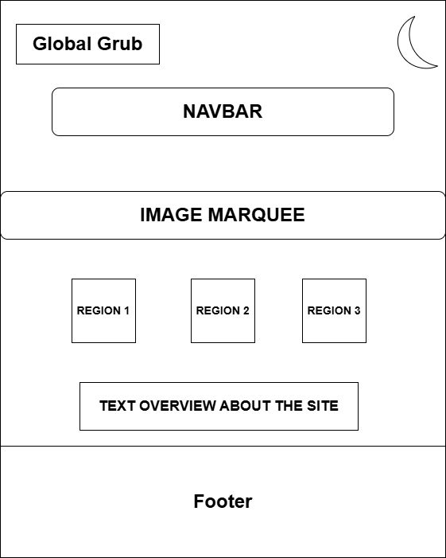
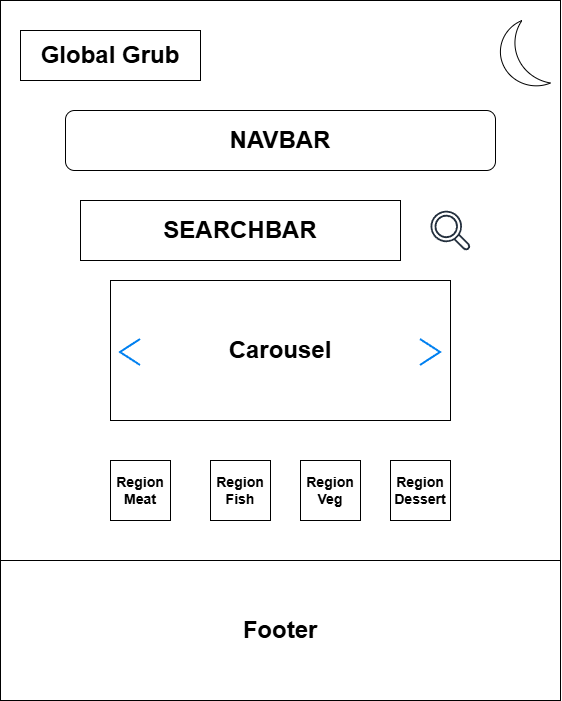
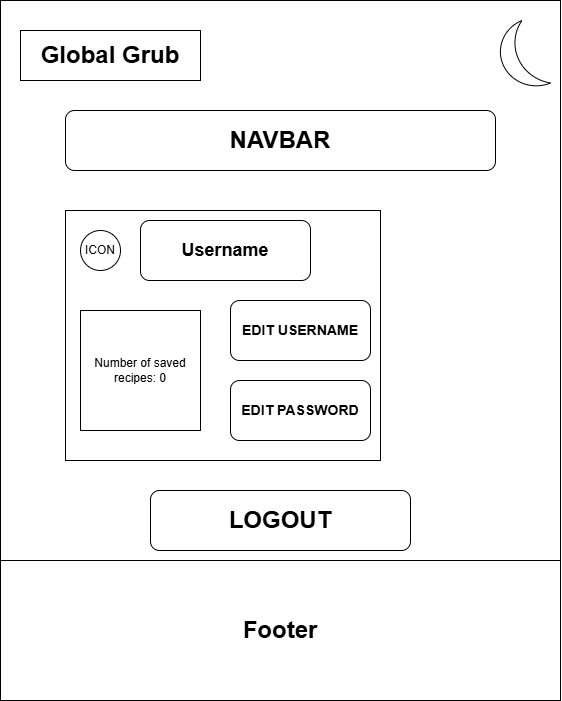

# GlobalGrub — Project Plan

## What is GlobalGrub?

GlobalGrub is a Flask web application I am building for my Python assignment. It will allow users to discover recipes from different cuisines and save their favourites. The app will use Flask (Python) for the backend, HTML/CSS for the frontend, JavaScript for interactivity, and will be deployed using Render.

---

## Pages and Structure

The application will use multiple HTML templates stored in a `templates` folder. A `base.html` file will act as a shared layout containing the navbar and footer, with other pages extending it.

Key pages include:
- Home (`home.html`)
- Recipes (`recipes.html`)
- Favourites (`favourites.html`)
- Sign Up (`signup.html`)
- Login (`login.html`)
- Profile (`profile.html`)
- About (`about.html`)

Static files will be organised into `css`, `js`, and `images` folders inside a `static` directory.

---

## Core Functionality

- User authentication using Flask sessions
- Recipe search using an external API (TheMealDB)
- Viewing recipe details
- Saving and retrieving favourite recipes
- Conditional UI based on login state

---

## Database

The application will use SQLite with Flask-SQLAlchemy.

Two tables will be created:
- **Users**: stores id, username, password (hashed), avatar
- **Favourites**: stores saved recipes and links to users via a foreign key

This structure allows each user to manage their own saved recipes.

---

## Authentication System

Users will be able to register and log in. Credentials will be stored securely in the database.

Flask sessions will be used to track logged-in users. The navigation bar will update dynamically depending on authentication status.

Form validation will ensure inputs are valid and usernames are unique.

---

## Application Flow

1. User signs up or logs in
2. User searches for recipes
3. Flask sends a request to the API
4. Results are displayed as recipe cards
5. User can save recipes
6. Saved recipes are stored and displayed in Favourites

---

## Frontend Design

The application will use a consistent theme and responsive layout. Features such as a navbar, hero section, and recipe cards will structure the interface.

JavaScript will handle interactivity including:
- Carousel filtering
- Dark mode toggle
- Mobile navigation menu
- Dynamic UI updates

---

## Flask Implementation

`app.py` will handle routing and backend logic.

- Routes will be created for each page
- POST requests will handle forms (login, signup, updates)
- The `requests` library will be used to interact with the API
- Templates will be rendered using Flask’s templating engine

---

## File Structure

- `app.py`
- `globalgrub.db`
- `requirements.txt`
- `render.yaml`
- `templates/`
- `static/`
- `docs/`

---

## Deployment

The application will be deployed using Render. The GitHub repository will be connected and the app will be run using Gunicorn.

---

## Stretch Goals

- Profile customisation (avatars)
- Improved filtering options
- Enhanced UI styling
- Error handling for API failures

## Wireframes

The wireframes below were created before development to plan the layout and structure of the main pages. They focus on the most complex parts of the application.

---

## Home Page Wireframe 

This wireframe shows the structure of the landing page, including the navbar, hero section, featured regions, and footer. It was used to plan the overall layout and first impression of the application.

---

## Recipes Page Wireframe 

This wireframe focuses on the main functionality of the app. It includes the search bar for API integration, the recipe results area, and the carousel section used to display curated dishes by region.

---

## Profile Page Wireframe

This wireframe outlines the user dashboard, including the avatar display, user information, and account management features such as editing details and logging out.

---
